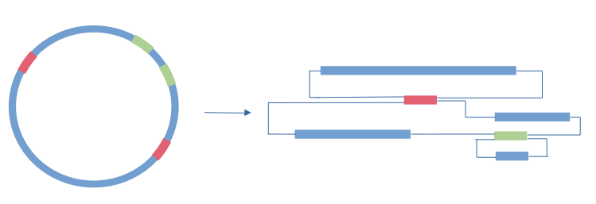

# Genome assembly

In this tutorial we will assemble short reads and long reads genomic sample, compare these and learn how to annotate the resulting assemblies.

## Before starting
#### Data
The dataset used is located at 

    /home/train/Data/Genomes
We have both long reads and short reads for isolates. We do not have reference for these organism and assembly/annotation will generate novel  knowledge.

#### Softwares
All software needed are installed under the conda environement named Genome_assembly. 

```bash
conda env list
conda activate Genome_assembly
```


#### Project folder
For the duration of this tutorial lets work in the following analysis folder:   
Make analysis folder

```bash
mkdir Projects/GenomeAssembly -p
cd Projects/GenomeAssembly
```


## Short reads assemblies

### Assembly with megahit

[Megahit](https://pubmed.ncbi.nlm.nih.gov/25609793/) is a fast and memory efficient assembler allowing for the coassembly of large number of sample. 

*Practical: Please find the correct command line to use*
	

 - you need to specify the path to the R1, R2 reads
 -  you need to specify an output folder /home/train/Projects/GenomeAssembly/....
 -  you need to specify the number of threads

<details><summary> solution</summary>
<p>

```bash
megahit -1 ~/Data/Genomes/short_read_data/BL23DE3_SR_1.fastq -2 ~/Data/Genomes/short_read_data/BL23DE3_SR_2.fastq -o BL23DE3_SR_megahit -t 8
```

</p>
</details>

*Q: Let's look at the output, where is the assembly file? How many contigs are there? How to assess the quality of this assembly? Why is this assembly fragmented?*



*Practical: Looking at number of reads in data, and total length of the assembly, calculate the average depth of coverage.*

*Practical: try varying some options e.g. --min-count or --k-list*

### Gene calling with [prodigal](https://bmcbioinformatics.biomedcentral.com/articles/10.1186/1471-2105-11-119)
Let's create an annotation directory in which we will output results from prodigal:
```bash
cd Projects/GenomeAssembly/BL23DE3_SR_megahit
mkdir annotation
cd annotation
prodigal -i ../final.contigs.fasta -o contigs -a contigs.faa -d contigs.fna
```

*Q: how many potential genes where predicted? What is the difference between .fna and .faa?*

### Checking draft genome quality with [checkm](https://www.ncbi.nlm.nih.gov/pmc/articles/PMC4484387/)

```bash
cd ~/Projects/GenomeAssembly/BL23DE3_SR_megahit
mkdir checkm
lineage_wf final.contigs.fa checkm -x .fa -t 4 --tab_table > checkm/checkm.out
```
*Q: What information does checkm uses to assess completion and contamination?*

### Assembly with [spades](https://www.ncbi.nlm.nih.gov/pmc/articles/PMC3342519/)

*Practical: The same information needs to be given to spades: reads path, output path/name and number of threads. As before, find the correct command line to use. **This will take some time, either do it inside a screen or open a new terminal.***

<details><summary> solution</summary>
<p>

```bash
cd ~/Projects/GenomeAssembly
export SRGENOME=~/Data/Genomes/short_read_data
spades -1 $SRGENOME/BL23DE3_SR_1.fastq -2 $SRGENOME/BL23DE3_SR_2.fastq -o BL23DE3_SR_spades -t 8
```

 </p>
</details>

### Kmer histograms with [KAT](http://bioinformatics.oxfordjournals.org/content/early/2016/10/20/bioinformatics.btw663.abstract)
*Practical: The KAT software is missing from your conda environment, use a simple command line to install it (clue look at the first result of a google search for conda install KAT)*

Let's use kat to create a kmer histogram of the samples:

```bash
kat hist -m27 $SRGENOME/BL23DE3_SR_*fastq
```

### Results of spades:
Spades doesn't output the statistics on assembly, we use a simple perl script to obtain similar statistics as for megahit:

 ```bash
cd BL23DE3_SR_spades
~/repos/GastroPak_Workshop/scripts/contig-stats.pl < contigs.fasta 
```

*Practical: adapt the previous command lines and run, prodigal and checkm on the spade assembly*

*Q: Which assembly is better? megahit/spades? Nb of genes?

### Looking at the assembly graph

The assembly graph for spades is contained in the file:

```
assembly_graph_with_scaffolds.gfa
```

This can be visualised with the program Bandage. You may be able to install this on your own laptop and download the fie. If so it will look like this:


*Q: Is this a good assembly graph?*

# PROKKA genome annotation pipeline

https://github.com/tseemann/prokka

Install:
    mamba install -c conda-forge -c bioconda -c defaults prokka
    

    prokka ../contigs.fasta
    
Visualise with Artemis (this may not be possible on server)

    sudo apt install artemis

    art annotation/PROKKA_06192023/PROKKA_06192023.gff 

So cool :)

# Long read assembly with flye

Assemble a genome with flye:

    flye --nano-raw BL21DE3_LR.fastq --out-dir BL21DE3_LR_flye --threads 8
    
Visualise assembly graph (not possible on server)


*QCount gene number, are there more less ORFs than for the short read assembly?


# Long read assembly
